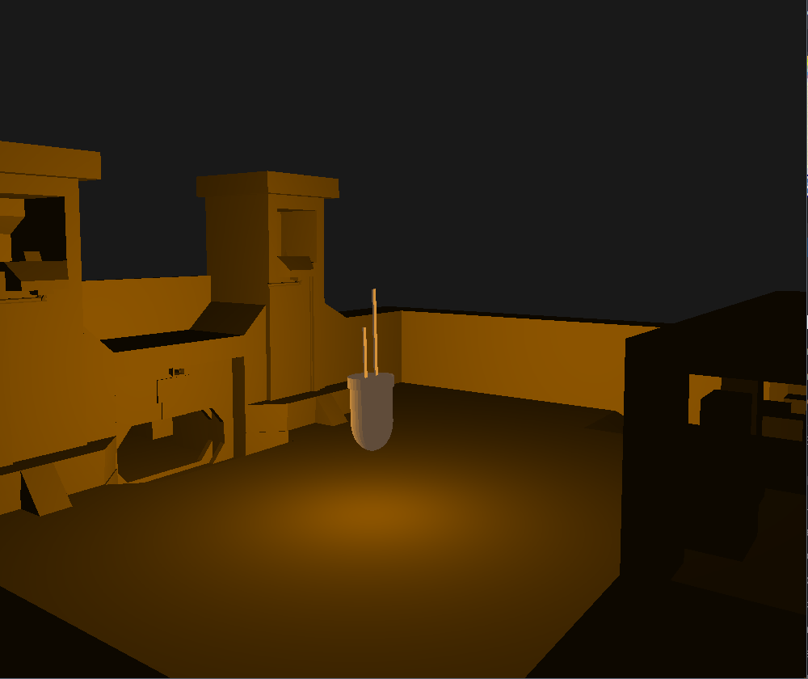

# OGL3DG

3d game that uses OpenGL. project started in september.

---

The following dependencies are used:

1.  [`OpenGL`](https://www.opengl.org) - Allows for drawing of graphics via the GPU
2.  [`GLFW`](https://github.com/glfw/glfw) - For creating the window and handling OS-specific operations
3.  [`GLAD`](https://github.com/Dav1dde/glad) - The OpenGL Loader-Generator based on the official specs.
4.  [`GLM`](https://github.com/Groovounet/glm) - Math Extensions for transformations

---

__This project's goals to be implemented:__

-   [x] Shader loader and compiler
-   [x] Loading of OBJ files
-   [x] Camera
-   [x] Textures
-   [x] Rotation, projection and movement (local Object)
-   [x] Simple lighting
-   [ ] Object material
-   [ ] Shadow
-   [ ] Sound system
-   [ ] Gameplay
